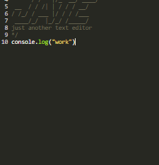
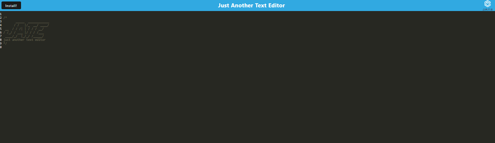

# PWA Text Editer

Protected by a  [License](#license)

## Description

A simple text editer. Note most files are depricated.

## Table of Contents

- [Installation](#installation)
- [Usage](#usage)
- [Credits](#credits)
- [License](#license)
- [Questions](#Questions)

## Installation

Hit the install button 

## Credits

Used to make read me https://github.com/jbird11801/ReadMeGenerator

## License

This project has the (MIT) license protecting it!

## Questions

Please contact me about this project here [jarodfredette@gmail.com](mailto:jarodfredette@gmail.com)
            
My git hub account is jbird11801 at https://github.com/jbird11801
